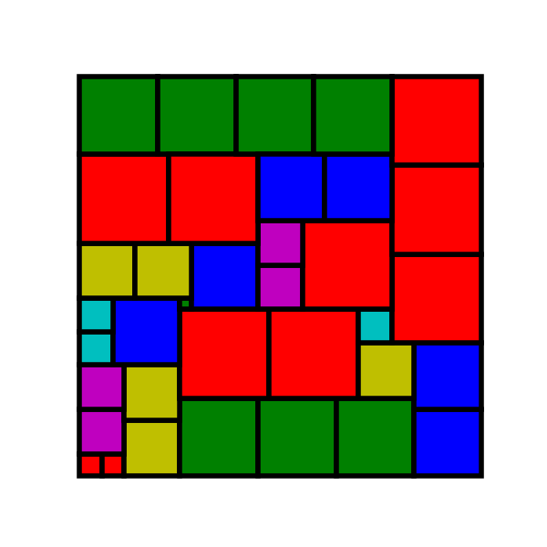

# Introduction

This project implements "Algorithm M: Covering with Multiplicities and Colors" from [Knuth Volume 4B](https://www-cs-faculty.stanford.edu/~knuth/taocp.html) section 7.2.2.1. It solves the MCC problem.

Other branches in this repo implement Algorithm X and Algorithm C.

## Differences

Knuth's algorithm allows the color of an item to be blank to indicate
it has a unique color (e.g. "x:"). The can be easily handed at problem setup
by simply making a new color. This code assume a color is always supplied.

These algorithms take their input from an **ExactCoverWithMultiplicitiesAndColors** structure,
as opposed to just a bunch of strings.

# Implementations

The project contains two different implementations of the algorithm.

## MStringValues.cpp

This implementation attempts to follow Knuth as closely as possible, as explained
in 7.2.2.1. 

Specficially:

- Single file implemetation with no classes
- Uses the same header/cell structure as Knuth
- Uses the same names for **cover()**, **uncover()**, etc. as Knuth
- State names in AlgXStates follow Knuth

There is quite a bit of extraneous code in the file in order to setup cell structure and produce output.
The algorithm itself is implemented in **exact_cover_with_multiplicities_and_colors()**.

## AlgMPointer

This implementation is what I would write C++ today. 

Specifically:

- Algorithm is in a class.
- Data structures uses pointers, instead of indices.

## Results

Along with some trival tests are solutions to the [partridge puzzle](https://www.mathpuzzle.com/partridge.html) and
the word rectangle problem (Knuth 66).

The two implementation have different sets of intermediat states, but have the same concept of level depth for searching.
Hence the number of level transitions is very close between the two (I'm not sure why they don't match exactly).

The test machine CPU is an i7-10875H CPU @ 2.30GHz with 32GB RAM.

# Partridge Problem

One of the solutions is:



Stats for the two implementations:

```
Exact cover with multiplicities and colors found 8 solutions.
        Time used (microseconds): 13072 for setup and 133,803,119 to run.
        Loop ran 42428206 times with 5769203 level transitions.
Found 8 solutions

Pointer based Exact cover with multiplicities and colors found 8 solutions.
        Time used (microseconds): 586457 for setup and 198841359 to run.
        Loop ran 25778664 times with 5790192 level transitions.
Found 8 solutions
```

# Word Rectangle Problem

Using a 20k word list, both implementation produce the same word rectangles:

```
12 word rectangle(s) found.
Rectangle:

n a m e s

a l e x a

m e g a n

e x a m s
8 letters used: a e g l m n s x

Rectangle:

g a m e s

a l e x a

m e g a n

e x a m s
8 letters used: a e g l m n s x

Rectangle:

t a m i l

e r a s e

s e l l s

t a l e s
8 letters used: a e i l m r s t

Rectangle:

f a r o e

a r e n a

s e a t s

t a r o t
8 letters used: a e f n o r s t

Rectangle:

a r e n a

n a m e d

a r m e d

l e a d s
8 letters used: a d e l m n r s

Rectangle:

l e a s e

o l s e n

a s k e d

d e s k s
8 letters used: a d e k l n o s

Rectangle:

c a n o e

a r e n a

s e a t s

t a r o t
8 letters used: a c e n o r s t

Rectangle:

s w e e t

h i n d i

i n d i e

t e s t s
8 letters used: d e h i n s t w

Rectangle:

s p e e d

h i n d i

i n d i e

t e s t s
8 letters used: d e h i n p s t

Rectangle:

l a d e n

a r e n a

b e a d s

s a l s a
8 letters used: a b d e l n r s

Rectangle:

t a s k s

i r e n e

r e n e e

e a t e n
8 letters used: a e i k n r s t

Rectangle:

t i t a n

i r e n e

d o n n a

e n t e r
8 letters used: a d e i n o r t
```

Performance stats are:
```
Exact cover with multiplicities and colors found 12 solutions.
        The non-sharp preference heuristic was used.
        Time used (microseconds): 7842 for setup and 23890664 to run.
        Loop ran 20296082 times with 2514210 level transitions.
         
Pointer based Exact cover with multiplicities and colors found 12 solutions.
        The non-sharp preference heuristic was used.
        Time used (microseconds): 1702705 for setup and 28271273 to run.
        Loop ran 11793781 times with 2514210 level transitions.
```

Although a bit harder to read, the "old school" implementation that closely follows Knuth is signficantly faster.

## Hueristic Effect

Both implementation support the "non-sharp preference heuristic" as described by Knuth.
It makes a big difference for the word problems!

Stats w/o the heuristic:

```
Pointer based Exact cover with multiplicities and colors found 12 solutions.
        Time used (microseconds): 1701858 for setup and 66768570 to run.
        Loop ran 126164757 times with 28152659 level transitions.
12 word rectangle(s) found
```

The heuristic is 2.4x faster and goes through 11x fewer levels.


